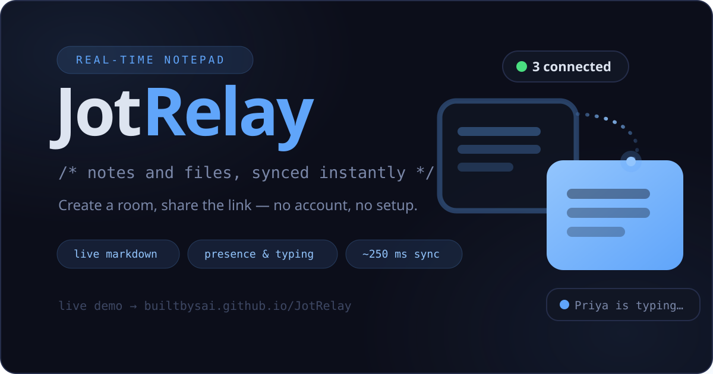

# JotRelay

<p align="center"></p>

> **A temporary shared notepad for fast handoff between devices.**  
> Create a room, share an editable or read-only link, and sync notes and files in real time — no account needed.

**Live demo:** `https://builtbysai.github.io/JotRelay/`

---

> ⚠️ **Personal / demo project.**  
> JotRelay is a personal project built for learning and portfolio purposes.  
> **Room links are frontend-restricted, not backend-secret.** Anyone who knows or guesses a room's URL can view **and edit** it — `?mode=read` and `/share/:token` read-only links are a UI convention, not a hard boundary (see `docs/security.md`). Use the room lock feature for an actual, server-enforced "nobody can edit this" guarantee.  
> View-once is a convenience feature, not a secure destruction guarantee. A viewer may copy, screenshot, save, or otherwise preserve content before it clears.  
> **Do not use JotRelay for passwords, HIPAA/PII, classified information, or any sensitive data.**

---

## Screenshots

The app's real CSS/markup, populated with realistic sample content (a
fictional "Q3 Product Roadmap" room) rather than a live production room — see
[`presskit/README.md`](presskit/README.md#screenshots) for the full set and
how they were generated.

| Live Markdown editor | Presence & collaboration | Encrypted room |
|---|---|---|
|  |  |  |

| Files panel | Share modal | Mobile layout |
|---|---|---|
|  |  |  |

---

## Project Highlights

- **Vanilla JavaScript** ES module architecture — no build step, no bundler, no framework
- **Supabase Realtime** for live sync via Broadcast (~250 ms) and Presence
- **Shareable temporary rooms** — editable and read-only links, QR codes
- **Typora-style live markdown editing** — the Live surface (CodeMirror 6) renders formatting inline as you type (hidden syntax markers, real tables/images/checkboxes) alongside a raw Source mode and a side-by-side Split view, plus a safe custom renderer (no CM6 dependency) powering export/print/file-preview output
- **File upload and preview** — images, text, Markdown, CSV, PDF (no library)
- **Presence, typing indicator, and cursor/activity tracking**
- **Ask AI** — select text and get a Gemini-powered suggestion added as a comment on that selection (never replaces your text, never sends the rest of the note); proxied through a Supabase Edge Function so no API key ever reaches the browser
- **Responsive layout** with 10 themes, bottom action bar on mobile
- **Progressive Web App** (PWA) — installable, offline-capable, and a Web Share Target so you can share text/links into JotRelay from your OS's own share sheet once installed
- **Thorough documentation** and a working Supabase SQL schema

---

## Features

### Core
- **Landing screen** — create a new room or join by URL or room ID
- **First-time tour** — a short 4-step coachmark walkthrough (editor, mode toggle, share, more menu) the first time this browser ever creates a room; shown once, never again
- **Realtime note sync** — Supabase Broadcast, ~250 ms latency
- **Durable saves** — Postgres write after 1 s of idle; local draft backup
- **Offline drafts** — keystrokes saved to localStorage; sync on reconnect
- **Conflict notice** — Apply / Keep mine / Copy remote / Dismiss when two devices edit simultaneously

### Sharing
- **Editable and read-only share links** — the plain room link is directly editable; `/share/:token` links stay read-only in the app's UI (see the Security note above for what that guarantees and what it doesn't)
- **Redesigned share modal** with edit-access and read-only cards
- **Short room codes** — a 6-character spoken/typed alternative to the full link (e.g. reading it aloud on a call), same access level as the plain link. Get one from the Share modal's "Short code" row; join with one by typing it straight into the landing page's join box. Requires the optional `supabase/migrations/0002_short_room_codes.sql` migration — see [Optional feature migrations](DEPLOYMENT.md#optional-feature-migrations)
- **QR codes** with download button for each link type
- **Room editing lock** — pause edits on all devices; enforced server-side by a database trigger, not just the frontend
- **"Share to JotRelay"** — once installed as a PWA, JotRelay registers as a Web Share Target in the OS's own share sheet; sharing text/a link from another app creates a brand-new room seeded with that title/text/URL as Markdown

### Content & Editing
- **Three editor modes — Source, Live, and Split** — Source shows raw markdown text; Live (the default for new rooms, remembered per-device once you switch) is a Typora-style CodeMirror 6 surface that renders formatting inline as you type — headings, bold/italic, GFM tables (editable in place — click a cell and type, Tab/Shift-Tab/Enter to navigate), images, checkboxes, GitHub-style alerts (`> [!NOTE]` etc.), footnotes, and syntax-highlighted fenced code blocks all render live, with raw syntax revealed only where the caret currently is; Split shows Source and Live side by side with synced scrolling
- **Safe Markdown rendering** — a from-scratch renderer (built on the same Lezer parse tree CodeMirror uses) with no raw HTML pass-through; powers export, PDF/print, and file preview output; XSS-safe
- **Images** — `` renders inline (http/https only)
- **Bare URL autolinking** — plain `https://…` text becomes a clickable link automatically
- **Nested lists** — indented bullet/numbered sub-items render as proper nested lists
- **Checklist preview** — GFM-style checkboxes; click to toggle, live in the editor
- **Templates Library v2** — 17 built-in templates (meeting, checklist, standup, bug report, code review, and more); searchable modal with two-column preview pane
- **Custom templates** — save, rename, delete, export/import as JSON (localStorage-backed, up to 50 000 chars each)
- **Find & Replace** — case-insensitive (toggle to case-sensitive) search with Prev / Next navigation, Replace, and Replace All
- **Selection context menu** — right-click selected text, in either Source or Live mode, for cut/copy/paste/delete/select-all or to add a comment, without navigating to the toolbar or Comments panel first. On a touchscreen, long-press defers to the device's own native text-selection UI (selection handles, the OS Copy/Select All/Share callout) instead of opening this menu
- **Inline comments** — anchor a comment to a text range from the Comments panel, the selection context menu, or the floating add-comment button (bottom-right of the editor, or `Ctrl/⌘ + Shift + /`) which opens a composer right at your selection/caret; a small dot in the editor's margin marks each comment's anchor line — click to expand it into a floating bubble with the full text and Prev/Next navigation between comments, without needing to open the panel; requires the optional `supabase/migrations/0003_room_comments.sql` migration
- **History panel** — a **Versions** tab to browse and restore past snapshots of a room's content (including a scrubbable time-slider; requires the optional `supabase/migrations/0004_version_history.sql` migration), plus an **Activity** tab that merges saved versions, comments, and file uploads into one chronological timeline
- **Ask AI** — select any text, describe what you want done with it (fix grammar, summarize, make more concise, …), and get a Gemini-powered response added as a **comment** on that selection — your note text is never changed, and only the selection is sent, never the rest of the note. One-time consent notice before the first use in a browser. Reachable from the toolbar, right-click context menu, Tools panel, command palette, or `Alt+Shift+A`. Requires deploying the `ask-ai` Supabase Edge Function with a `GEMINI_API_KEY` secret — see `supabase/functions/ask-ai/README.md`
- **Command palette** — `Ctrl/⌘ + K` (or the More menu) opens a searchable list of every app action — modes, panels, sharing, export, themes, and more — filter by typing, navigate with arrow keys, run with Enter
- **Slash-command quick-insert** — type `/` at the start of a line (Source mode) to open a filterable popup for headings, lists, checklist, links, code blocks, dividers, timestamp, and templates, without leaving the keyboard for the toolbar
- **Keyboard shortcuts** — see [Keyboard Shortcuts](#keyboard-shortcuts) below
- **Export** — download as `.txt`, `.md`, rendered `.html`, or PDF (browser print); copy as plain text or rendered HTML
- **Monospace toggle, Focus mode, Typewriter mode, smart punctuation, paste-as-plain-text** — opt-in editor preferences, remembered per-device across rooms
- **Timestamp insert** — add current date/time inline

### Collaboration
- **Presence indicator** — see all connected devices with online count
- **Typing indicator** — shows when another device is actively editing
- **Cursor / activity line** — approximate editor line broadcast to other devices (throttled)
- **Device rename** — tap your device name to rename it locally
- **Recent rooms** — the landing page remembers the last 8 rooms visited on this device (local only) for one-click return

### Security & Privacy (all frontend/convenience — see Known Limitations)
- **Passcode gate** — PBKDF2-hashed passcode; convenience only
- **Text & file encryption** — AES-256-GCM + PBKDF2 in-browser; encrypted rooms use DB-only content sync (no plaintext live snapshots); files uploaded to an encrypted room are content-encrypted with the same key (filename/type stay plaintext; see `docs/security.md`)
- **Auto-expiration** — rooms cleared at open after expiry; pg_cron backend cleanup optional
- **View-once** — note cleared server-side after first non-creator editable viewer
- **Device limit** — auto-clear the note once N distinct devices (excluding the creator's own) have joined the room; requires the optional `supabase/migrations/0005_device_limit.sql` migration
- **Timed reveal** — hide a room's content from everyone but its creator until a set future time (the mirror image of Auto-expire); the creator keeps writing normally while a non-creator visitor sees a live countdown instead of the note. Convenience only, same as passcode; requires the optional `supabase/migrations/0015_timed_reveal.sql` migration
- **Anonymous write rate limiting** — server-side, per-device and per-IP caps on room creation and report submission; requires the optional `supabase/migrations/0010_anonymous_write_rate_limiting.sql` migration

### Files
- **File attachments** — upload up to 10 MB per file; signed download URLs (1 h TTL)
- **Multi-file upload** — select or drag-and-drop multiple files at once; uploaded sequentially with progress
- **Bulk select & delete** — multi-select checkboxes with a confirmation modal for deleting several files at once
- **Correct download filenames** — downloads are saved under the original uploaded filename, not the internal Storage path
- **File preview** — see [File Preview](#file-preview) below
- **Drag-and-drop upload** — drop anywhere on the Files panel or editor area; visible overlay
- **Read-only file access** — read-only users can preview and download files but cannot upload or delete

### Appearance & UX
- **10 themes** — Charcoal Amber, Midnight Blue, Forest Green, Terminal, Mocha Dark, Crimson Night, Paper Light, Lavender Light, Arctic, Rose
- **Mobile layout** — bottom action bar with one-thumb access to all major features
- **PWA** — installable on desktop and mobile; offline-capable for cached assets


## Keyboard Shortcuts

| Shortcut | Action |
|---|---|
| `Ctrl/⌘ + S` | Force save |
| `Ctrl/⌘ + F` | Find in note (Find & Replace panel) |
| `Ctrl/⌘ + B` | Bold selected text |
| `Ctrl/⌘ + I` | Italic selected text |
| `` Ctrl/⌘ + ` `` | Inline code |
| `Ctrl/⌘ + K` | Insert Markdown link (in the editor) — or open the **command palette** everywhere else, to search and run any app action by name |
| `Ctrl/⌘ + Shift + S` | Toggle Split view |
| `Ctrl/⌘ + Shift + M` | Toggle Monospace font |
| `Ctrl/⌘ + Shift + /` | Add a comment at the cursor/selection |
| `Ctrl/⌘ + /` | Open keyboard shortcuts help |
| `Alt + Shift + P` | Toggle Live mode |
| `Alt + Shift + S` | Open the Share modal |
| `Alt + Shift + T` | Insert a timestamp |
| `Alt + Shift + C` | Copy the note |
| `Alt + Shift + A` | Ask AI — comment on the current selection |
| `Tab` / `Shift + Tab` | Indent / dedent (in the editor) |
| `Esc` | Close panel / modal / dropdown |

Formatting shortcuts (`B`, `I`, `` ` ``, `K` for links) do nothing in read-only or locked mode. The last four rows use `Alt+Shift` rather than `Ctrl/⌘+Shift` because those specific letter combos are already claimed by browser/OS chrome (reopen-closed-tab, Inspect Element, Private Window, Firefox's Web Console) that page JavaScript cannot override.

---

## File Preview

In-app file preview is built with vanilla JS and the Fetch API — no external library.

| File type | Preview behavior |
|---|---|
| PNG, JPG, GIF, WebP | Image shown in modal lightbox |
| SVG | Opens in a new tab for XSS safety |
| PDF | Opens in a new tab via signed URL |
| `.txt`, `.log`, `.json`, `.xml`, `.yaml`, `.sh`, `.js`, `.ts`, etc. | Shown as preformatted plain text |
| `.md`, `.markdown` | Rendered via the built-in safe Markdown renderer |
| `.csv` | Rendered as a plain HTML table (up to 300 rows) |
| All other types | Filename, type, size, and Open / Download button |

Large files (>100 KB) show a truncation warning and display only the first 100 KB.  
All previews use signed URLs — the storage bucket remains private.

Close the preview modal with the ✕ button, clicking the backdrop, or pressing `Esc`.

---


## Storage Orphan Cleanup

### Why orphaned files occur

When a room is deleted, Postgres cascade-deletes the `syncpad_files` metadata rows. However, `ON DELETE CASCADE` does **not** remove the physical objects in the Supabase Storage bucket. Storage and database are separate systems.

Orphaned objects (files in the bucket with no matching metadata row) can accumulate over time.

### Automated cleanup

The optional Supabase Edge Function at `supabase/functions/syncpad-cleanup` can run with a service-role key to:

- delete physical Storage objects for expired rooms before encrypted expired rooms are deleted
- call the existing `cleanup_expired_syncpad_rooms()` database function
- list bucket objects and remove confirmed orphans whose `file_path` no longer exists in `syncpad_files`
- run in dry-run mode first

Example manual invocation after deployment:

```bash
curl -X POST "https://YOUR-PROJECT-REF.functions.supabase.co/syncpad-cleanup" \
  -H "Authorization: Bearer $SYNCPAD_CLEANUP_SECRET" \
  -H "Content-Type: application/json" \
  -d '{"mode":"all","dryRun":true}'
```

Set `dryRun` to `false` only after reviewing the dry-run counts.

### Running orphan reconciliation from the admin dashboard

Once deployed, the Cleanup tab's **Storage Orphan Reconciliation** section calls the
same function (`mode: "orphans"`) directly from the browser, authenticated with the
signed-in admin's own Supabase session rather than `SYNCPAD_CLEANUP_SECRET` — the
Edge Function validates that session and checks the user against `syncpad_admins`
itself, so the secret never needs to reach the client. It previews the orphan count
first and only deletes after an explicit confirm. Requires the function to actually
be deployed (`supabase functions deploy syncpad-cleanup`); the button surfaces a
clear error if it isn't reachable.

### Manual cleanup steps

1. **List metadata paths** - query `syncpad_files` for all `file_path` values.
2. **List storage objects** - use Supabase Dashboard -> Storage -> `syncpad-files` bucket, or the Storage REST API.
3. **Cross-reference** - identify objects in storage with no matching `file_path` row.
4. **Delete orphans** - remove only confirmed orphaned objects.

```sql
-- Step 1: all file paths tracked in metadata
SELECT room_id, file_path, filename, file_size
FROM   syncpad_files
ORDER  BY room_id, uploaded_at;

-- NOTE: SQL alone cannot list Supabase Storage bucket objects.
-- Use the Supabase Dashboard or the Storage Management API for step 2.
```

> Always back up before deleting. Deleted storage objects cannot be recovered.

---


## Web3Forms operations (Contact page)

- The Web3Forms access key in `index.html` is a **public frontend key**; do not treat it like a private service-role secret.
- In Web3Forms dashboard, set **Allowed domain** to `builtbysai.github.io`.
- Recommended **subject**: `New JotRelay Contact Form Submission`.
- Recommended **from_name**: `JotRelay Contact Form`.
- Keep **hCaptcha disabled** unless/until a frontend hCaptcha widget is implemented.
- Keep Web3Forms `botcheck` honeypot enabled.
- Room-report abuse controls are DB-enforced via reason allowlist + details max length checks and insert-only anon RLS.

## Known Limitations

| Limitation | Notes |
|---|---|
| No user accounts or authentication | Normal users do not log in; JotRelay is anonymous and link-based — "ownership" of a room means knowing its URL, not an identity |
| Read-only links are frontend-only | `?mode=read` and `/share/:token` restrict the app's own UI but are not a server-enforced boundary — `room_id` alone is sufficient to write (see `docs/security.md`). Use room lock for an actual guarantee |
| Room lock IS backend-enforced | A database trigger, not just frontend JS — this is the one real, server-enforced "nobody can edit this" control |
| Admin access requires Supabase Auth | The `/admin` route is protected by `signInWithPassword` + `is_syncpad_admin()` RLS — not for end users |
| View-once is convenience-only | Not a secure destruction guarantee; viewers can still copy or capture content before it clears |
| File filename/type are not encrypted | A file's content is encrypted in an encrypted room, but its name and MIME type stay plaintext, and files uploaded before encryption was turned on stay plaintext too |
| Passcode is a convenience gate | Hash is checked client-side; not server-enforced |
| Timed reveal is a convenience gate | A pure client-side time comparison, checked only at join time; not server-enforced, and doesn't retroactively hide content from a device already inside the room when it's turned on remotely |
| Storage cleanup needs service-role maintenance | Admin room deletion removes known physical objects first; backend cleanup paths need the optional `syncpad-cleanup` Edge Function because SQL cannot delete Storage objects |

---

## Technical Notes

### Architecture

```
Browser UI (HTML/CSS/JS)
    └── ES Modules (src/*.js, plus src/app/*.js, src/ui/*.js, src/admin/*.js)
            ├── app.js          — thin entry point; routing/join-flow/event wiring in src/app/*.js
            ├── ui.js           — barrel over src/ui/*.js; all DOM manipulation
            ├── sync.js         — live typing + durable save lanes
            ├── presence.js     — device/typing/cursor tracking
            ├── live-broadcast.js — Supabase Broadcast events
            ├── live-editor.js  — CodeMirror 6 Live/Split editable preview surface
            ├── rooms.js        — room CRUD, read-only share links, short codes
            ├── comments.js     — anchored inline comments (optional migration)
            ├── revisions.js    — version-history snapshots (optional migration)
            ├── offline.js      — localStorage draft save/restore
            ├── files.js        — upload, download, delete (signed-URL cache)
            ├── file-preview.js — in-app preview modal
            ├── markdown.js     — safe custom Markdown renderer (Lezer parse tree)
            ├── encryption.js   — AES-256-GCM + PBKDF2 (Web Crypto)
            ├── permissions.js  — frontend permission context
            ├── settings.js     — room settings (passcode, expiry, etc.)
            ├── templates.js    — 17 built-ins + localStorage custom templates
            ├── theme.js        — CSS variable theme system
            ├── shortcuts.js    — keyboard shortcut handler
            ├── ask-ai.js       — Ask AI client, proxied through the ask-ai Edge Function
            └── admin.js        — admin dashboard entry point; shell/tabs in src/admin/*.js

Supabase Backend
    ├── syncpad_rooms         (Postgres table + Realtime)
    ├── syncpad_files         (Postgres table + Realtime)
    ├── syncpad_room_comments (Postgres table, optional migration)
    ├── syncpad_room_revisions (Postgres table, optional migration)
    ├── syncpad_share_links   (Postgres table)
    ├── syncpad_room_reports  (Postgres table, insert-only for anon)
    ├── syncpad-files         (Storage bucket, private, signed URLs)
    └── Edge Functions        — syncpad-cleanup (Storage orphan cleanup), ask-ai (Gemini proxy for Ask AI)
```

See [`docs/architecture.md`](docs/architecture.md) for the full module-by-module breakdown and data flow diagrams.

### Key design decisions

- **No build step** — ES modules load directly in the browser; deployment is a simple `git push`
- **No raw HTML pass-through** — the Markdown renderer escapes everything first, then applies a safe allow-list of tags
- **Two sync tracks** — Broadcast for live typing (~250 ms), Postgres for durable saves (1 s debounce)
- **Encryption in-browser only** — AES-256-GCM key derived from passphrase via PBKDF2; plaintext never leaves the device over the network when encryption is active
- **Service worker** — network-first caching for same-origin assets; Supabase traffic bypassed entirely
- **Theme system** — CSS custom properties with a `data-theme` attribute on `<html>`; 10 themes with zero runtime overhead

### Tech stack

| Layer | Technology |
|---|---|
| Frontend | Vanilla HTML + CSS + ES Modules |
| Realtime sync | Supabase Broadcast |
| Presence | Supabase Presence |
| Database | Supabase Postgres (with RLS) |
| File storage | Supabase Storage (private bucket, signed URLs) |
| Encryption | Web Crypto API (PBKDF2 + AES-GCM-256) |
| Markdown | Custom safe renderer (built from scratch) |
| File preview | Fetch API + vanilla JS (no library) |
| PWA | Service Worker + Web App Manifest |
| Tests | Playwright — chromium runs by default; firefox/webkit/mobile-chrome are configured but commented out so `npm test` doesn't require a full browser download |

---

## Documentation

| Document | Description |
|---|---|
| [`DEPLOYMENT.md`](DEPLOYMENT.md) | Step-by-step deploy guide — Supabase project setup, **all SQL (base schema + every optional feature migration)**, GitHub Pages, custom domain |
| [`docs/architecture.md`](docs/architecture.md) | Module responsibilities, data flow, state management |
| [`docs/security.md`](docs/security.md) | Security model, encryption, XSS mitigations, known limitations |
| [`docs/playwright.md`](docs/playwright.md) | Running and writing Playwright tests |
| [`docs/marketing-site.md`](docs/marketing-site.md) | How the landing page and `presskit/` are built and maintained |
| [`presskit/README.md`](presskit/README.md) | Press/media kit — logos, screenshots, fact sheet |
| [`CHANGELOG.md`](CHANGELOG.md) | Change history |
| [`RELEASE_CHECKLIST.md`](RELEASE_CHECKLIST.md) | Pre-release verification checklist |
| [`CLAUDE.md`](CLAUDE.md) | Development guide for AI coding assistants |

---

## Testing

```bash
npx playwright install # one-time browser download
npm test               # run all tests (headless) — auto-starts tests/spa-server.js on :5555 if nothing is listening there yet
npm run test:ui        # Playwright UI mode
npm run test:chrome    # chromium only
npm run test:report    # open HTML report
```

To browse the app itself (not run tests), `npm run serve` and open `http://localhost:5555/JotRelay/` — it runs the same `tests/spa-server.js` the test suite uses, so `/JotRelay`-prefixed assets and in-app routes both resolve correctly.

See [`docs/playwright.md`](docs/playwright.md) for the full test guide.

---

## Roadmap

### Recently completed

- [x] Ask AI — selection-only, Gemini-powered, comment-based rewrite/summarize assistant, proxied through a Supabase Edge Function
- [x] Timed reveal — hide a room from everyone but its creator until a set future time
- [x] History panel Activity tab — a merged timeline of saved versions, comments, and file uploads
- [x] Editable tables in the Live surface — click a cell and type, Tab/Shift-Tab/Enter to navigate
- [x] Web Share Target — "Share to JotRelay" from the OS share sheet once installed as a PWA
- [x] Command palette — `Ctrl/⌘+K` opens a searchable list of every app action
- [x] Multi-file upload — drag-and-drop and file-picker both accept multiple files at once, uploaded sequentially with per-file progress
- [x] Correct download filenames — downloads now carry the original uploaded filename via a forced-download signed URL, instead of the sanitized/timestamped Storage path name
- [x] PWA last-room resume — installed/standalone launches reopen the last room instead of the landing screen
- [x] Markdown: image embedding (``), bare-URL autolinking, and nested lists
- [x] Find & Replace — case-sensitive toggle (`Aa`), Replace / Replace All
- [x] Expiration countdown — live "expires in Xh Xm Xs" bar; relative time in settings panel
- [x] Syntax highlighting — real per-token highlighting natively in the Live/Split surface (CodeMirror 6 + `@lezer/highlight`); Prism.js autoloader still covers the static rendered-HTML fallback preview path
- [x] Bulk file delete — multi-select checkboxes with confirmation modal
- [x] File sort — 6 orderings in the Files panel (newest, oldest, name, size)
- [x] Admin dashboard — Supabase Auth gate, rooms / reports / cleanup tabs
- [x] Templates Library v2 — 17 built-ins, searchable modal, export / import JSON
- [x] PDF export — browser `window.print()` in a styled preview window
- [x] Playwright test suite — grown from an initial ~75 scenarios across 6 spec files to 43 spec files today; see `docs/playwright.md` for current scope
- [x] Editor modernization — floating card layout, comfortable max writing width, split-view divider
- [x] Typora-style Live editing surface — CodeMirror 6-backed, replacing the old read-only rendered-HTML preview pane as the default view for new rooms

### Takeover roadmap completed

- [x] Keep JotRelay as a transparent demo project and document frontend-only permission boundaries
- [x] Encrypt file attachment content client-side for encrypted rooms and document Storage behavior
- [x] Allow read-only viewers to unlock passcode/encrypted rooms when they separately have the secret
- [x] Keep GitHub Pages `/JotRelay` as the permanent target while centralizing runtime base-path handling
- [x] Delete known physical Storage objects during admin room deletion paths
- [x] Add optional service-role Edge Function for backend Storage cleanup and orphan cleanup
- [x] Batch admin expired-room cleanup queries for larger room sets
- [x] Add real `/share/:token` protected-room regression tests
- [x] Add admin user setup documentation in `docs/admin-setup.md`
- [x] Bump service worker cache version on every release that changes cached assets — check `service-worker.js`'s `CACHE_VERSION` for the current value, since it changes with nearly every release and this doc doesn't get updated in lockstep
- [x] Anonymous write rate limiting for room creation (30/device + 60/IP per 15 min) and report submission (10/device + 20/IP per 15 min) — optional `supabase/migrations/0010_anonymous_write_rate_limiting.sql`; see [Optional feature migrations](DEPLOYMENT.md#optional-feature-migrations)

### Outside current demo scope

- Rate limiting for share-link resolution specifically (room creation and report submission are covered — see above) — see `docs/security.md`
- Live deployment verification after Supabase/GitHub Pages secrets are configured

---

## License

Personal / demo project. Not licensed for production use with sensitive data.

---

*Built by [Hans Sai](https://builtbysai.com)*
